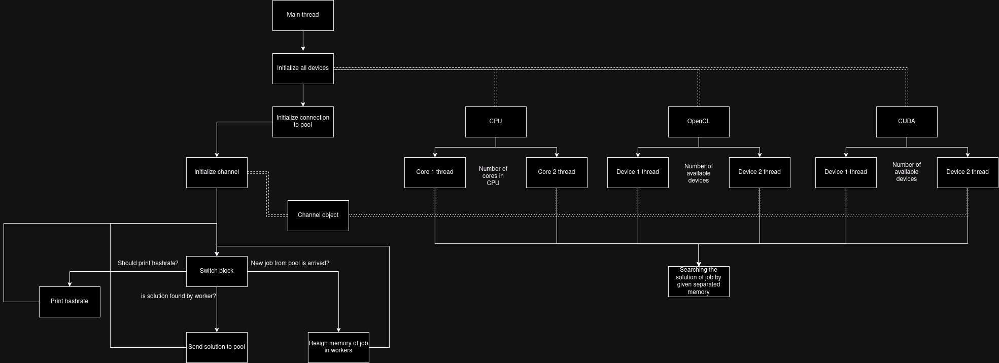
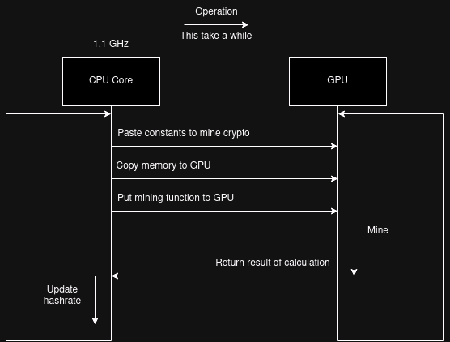

# Miner
- [Miner](#miner)
	- [How we increase performance](#how-we-increase-performance)
		- [CPU Boost](#cpu-boost)
	- [Supported Algorithms and Devices](#supported-algorithms-and-devices)
	- [Supported parameters](#supported-parameters)
		- [Example start](#example-start)
			- [Linux](#linux)
			- [Windows](#windows)
	- [Preparing system to mine cryptocurrency](#preparing-system-to-mine-cryptocurrency)
		- [Linux](#linux-1)
			- [Common packages](#common-packages)
			- [CUDA and OpenCL](#cuda-and-opencl)
			- [AMD and Nvidia drivers](#amd-and-nvidia-drivers)
		- [Windows](#windows-1)
		- [HiveOS](#hiveos)
	- [Contributors and Authors](#contributors-and-authors)
	- [Coming soon](#coming-soon)
	- [Link](#link)

## How we increase performance
To achive more performance in memory managment **we develop MINUX-Miner on basic C (not C++)**. We use **POSIX threads** in linux as they have more system achivements. For example, you have 1 CPU with 2 Cores, 2 CUDA devices (Nvidia) and 2 OpenCL devices. The main diagram of miner is show below. We sign **for each Core the parallel thread** to make CPU work better. **For each device we sign thread** to make devices for in parallel. **We use basic C sockets to make connection to pool faster**. After all workers are initialized we create channel **to make all threads be able to communicate with each other**. When we got solution from pool we assign new job for each device. We have to calculate hashes and find a nonce parameter (this is solution). Nonce parameter starts with 0 and ends with 18,446,744,073,709,551,615. This is really big and we devide this job between devices. Each device has **personal range of nonce to calculate hashes**. It means each device works independently. For example (nonce range depends on performance of your devices):
1. Assign CPU Core 1 nonce range from 0 to 3,074,457,345,618,258,602
2. Assing CPU Core 2 nonce range from 3,074,457,345,618,258,603 to 6,148,914,691,236,517,205
3. Assign CUDA 1 nonce range from 6,148,914,691,236,517,206 to 9,223,372,036,854,775,808
4. Assign CUDA 2 nonce range from 9,223,372,036,854,775,809 to 12,297,829,382,473,034,410
5. Assign OpenCL 1 nonce range from 12,297,829,382,473,034,411 to 15,372,286,728,091,293,012
6. Assign OpenCL 2 nonce range from 15,372,286,728,091,293,013 to 18,446,744,073,709,551,615

If miner got new job from pool **it resigns** memory with calculating parameters (boundary hash, seed hash, header hash...). We do not copy memory to make miner faster. In calculating and hashing of algorithm we use **assembler insert code** to achive high performance. Assembler is a programming language that works directly with CPU instructions.
For example:
```asm
.globl sha256_init
sha256_init:
	add r0, r0, #CTX_STA
	ldr r1, =h
	add r3, r1, #32
1:
	ldr r2, [r1], #4
	str r2, [r0], #4
	cmp r1, r3
	blo 1b
	mov r1, #0
	str r1, [r0], #4
	str r1, [r0], #4
	str r1, [r0], #4
	mov pc, lr
```

```C
int main()
{
    sha256_init();
    return EXIT_SUCCESS;
}
```



### CPU Boost
You can try to increase your hashrate by **--cpu-boost** parameter. This parameter is used to **overload CPU Cores, mine on them and make working with GPU faster**.
For example, if you disable CPU boost your time to call, copy, move and paste operations from CPU Core to GPU take more time in reason of:
1. Your CPU Core has lower frequency
2. Working GPU thread takes more time to be executed
3. Your CPU Core working in "cold" mode (let's say it is lazy to work)
   
Basic interaction between CPU and GPU you can find below in picture. The **faster** this interaction is passed the **higher hashrate** you will have



**WARNING:** On startup the hashrate of GPU is really high. You need to wait ~30 minutes before miner stabilize hashrate

## Supported Algorithms and Devices
| Algorithm | Nvidia GPU | AMD GPU | Intel GPU | Intel CPU | AMD CPU | Mac CPU |
|-----------|------------|---------|-----------|-----------|---------|---------|
| ethash    | +          | +       | -         | +         | +       | -       |
| etchash   | +          | +       | -         | +         | +       | -       |
| kawpow    | +          | -       | -         | +         | +       | -       |

## Supported parameters
| Short name | Name                 | Description                                                              |
|------------|----------------------|--------------------------------------------------------------------------|
| -a         | --algorithms         | Algorithm you want to mine                                               |
| -p         | --pool               | Pool address : stratum+tcp://[domain]:[port]                             |
| -w         | --wallet             | Wallet address where to mine                                             |
| -r         | --worker             | Name of worker in pool                                                   |
| -s         | --password           | Pool password to be authorized                                           |
| -d         | --devices            | List of Devices IDs to mine on (separated by ',') (default all devices)  |
| -c         | --cpu-enable         | Enable boost hashrate by CPU device (default is false)                   |
| -u         | --cuda-enable        | Enable Mining on CUDA (Nvidia) devices (default is false)                |
| -l         | --opencl-enable      | Enable Mining on OpenCL (AMD) devices (default is false)                 |
|            | --api-enable         | Enable API binding (default is false)                                    |
| -l         | --nvidia-use-opencl  | Force Nvidia to use OpenCL except CUDA (default is false)                |
|            | --config-file        | Path to configuration file for miner                                     |
|            | --api-host           | Host for API binding (default is 127.0.0.1)                              |
|            | --api-port           | Port for API binding (default is 10000)                                  |

### Example start
#### Linux
```bash
./MINUX-Miner -a ethash -p stratum+tcp://etc.2miners.com:1010 -w 0xa7e593bde6b5900262cf94e4d75fb040f7ff4727 -r WORKER -s x --cpu-enable
```
#### Windows
Coming soon

## Preparing system to mine cryptocurrency
### Linux
#### Common packages
```bash
sudo apt install glibc-source libcrypto++-dev wget
```
#### CUDA and OpenCL
```bash
# OpenCL
sudo apt install ocl-icd-opencl-dev

# CUDA
sudo apt install nvidia-cuda-toolkit
```
#### AMD and Nvidia drivers
```bash
# Nvidia
sudo apt install nvidia-driver-535 nvidia-dkms-535 nvidia-settings nvidia-prime nvidia-common libnvidia-ml-dev libxnvctrl-dev libxnvctrl0

# AMD
wget -r -np -nd -A deb https://repo.radeon.com/amdgpu-install/latest/ubuntu/jammy/
sudo apt install ./amd*
sudo amdgpu-install
```
### Windows
Coming soon

### HiveOS
Open console and write a command
```bash


```

## Contributors and Authors
This miner is developed by **MINUX** organization. Find us on github: **https://github.com/MINUX-organization**
If you have questions or suggestions you can contact to us:
**Telegram:** @gerrfrog @minux_wait_list @minuxos
**E-Mail:** ghaghal93@gmail.com
**WEB-Site:** https://minux.pro
**Github:** https://github.com/GerrFrog

## Coming soon
1. ProgPow mining algorithms

## Link
- [Install cuda 11.8](https://developer.nvidia.com/cuda-11-8-0-download-archive?target_os=Linux&target_arch=x86_64&Distribution=Ubuntu&target_version=22.04&target_type=deb_network)
- [cuda 11.8 architectures](https://arnon.dk/matching-sm-architectures-arch-and-gencode-for-various-nvidia-cards/)
